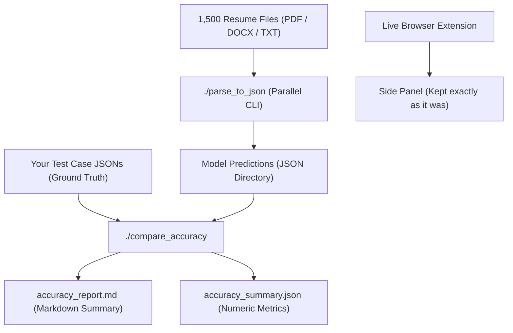

# Batch Evaluation & Accuracy Comparison Guide (1,500+ Resumes)

This guide explains how to convert 1,500+ resumes directly into JSON format and benchmark/compare them against your ground-truth test cases to measure model accuracy.

---

## 1. Architecture: The Document Idea

Instead of manually clicking through 1,500 resumes in the browser side panel, we provide a **two-track architecture**:



1. **Dedicated CLI JSON Converter (`./parse_to_json`)**: Runs the exact same 12-stage parsing pipeline directly from the command line in parallel workers. It processes hundreds of resumes per minute and outputs pure, standardized JSON files without opening any browser or side panel.
2. **Accuracy Comparator (`./compare_accuracy`)**: Compares your test case JSONs against the model's parsed JSONs, matching employers, dates, projects, and durations using fuzzy matching, and calculates Precision, Recall, and F1.
3. **Browser Side Panel (Intact)**: The side panel remains untouched and exactly as it was for live recruiter review with timeline, gap detection, and grounding. All JSON extraction is handled via the separate command line tool.

---

## 2. Standard Model JSON Schema

Each resume converted by `scripts/batch_parse.py` produces a JSON file with this structure:

```json
{
  "file_name": "A A Ashwini_1.pdf",
  "candidate_name": "A A ASHWINI",
  "status": "SUCCESS",
  "quality": {
    "dated_events": 9,
    "total_events": 9,
    "document_accuracy": 0.88
  },
  "work_experience": [
    {
      "company": "Sonata Software Ltd",
      "title": "",
      "start_date": "2023-12",
      "end_date": "present",
      "duration": "",
      "is_current": true,
      "status": "CONFIRMED",
      "confidence": 0.9
    },
    {
      "company": "Tiger Analytics",
      "title": "",
      "start_date": "2022-05",
      "end_date": "2023-11",
      "duration": "",
      "is_current": false,
      "status": "CONFIRMED",
      "confidence": 0.9
    },
    {
      "company": "Tech Mahindra",
      "title": "",
      "start_date": "2018-07",
      "end_date": "2019-05",
      "duration": "",
      "is_current": false,
      "status": "CONFIRMED",
      "confidence": 0.9
    }
  ],
  "projects": [
    {
      "name": "Project: 1: Microsoft",
      "client": "Microsoft",
      "role": "Senior Digital Engineer",
      "duration": "Dec-23 to Dec-24",
      "details": ["Acted as a trusted advisor..."]
    },
    {
      "name": "Project: 2: KELLOGS",
      "client": "KELLOGS",
      "role": "Senior Analyst in DS",
      "duration": "Apr-23 to Nov-23",
      "details": ["Responsible for analysing..."]
    }
  ],
  "gaps": [
    {
      "start": "2020-02",
      "end": "2022-04",
      "months": 27,
      "state": "POTENTIAL_GAP",
      "confidence": 0.9
    }
  ],
  "total_work_experience_entries": 3,
  "total_projects_entries": 6,
  "total_gaps_detected": 1
}
```

---

## 3. Step-by-Step Instructions

### Step 1: Batch Convert Your 1,500 Resumes to JSON
Run `scripts/batch_parse.py` pointing to the folder containing your 1,500 resume files:

```bash
./venv/bin/python scripts/batch_parse.py \
  --input-dir /path/to/your/1500_resumes/ \
  --output-dir dataset/model_parsed_json/ \
  --workers 8
```

- `--input-dir`: Folder with your PDF, DOCX, or TXT resumes.
- `--output-dir`: Where the generated JSON files will be written (one JSON per resume).
- `--workers`: Number of parallel CPU workers (e.g. 4, 8, or 16). 1,500 resumes typically finish in **2 to 5 minutes**.

*(For a single file, you can run:*
`./venv/bin/python scripts/batch_parse.py --input resume.pdf --output result.json`*)*

---

### Step 2: Run Accuracy Comparison
Once both folders are ready:
1. `dataset/model_parsed_json/` (generated by the model in Step 1)
2. `/path/to/your_ground_truth_json/` (your test case JSONs)

Run the comparison tool:

```bash
./venv/bin/python scripts/compare_accuracy.py \
  --pred-dir dataset/model_parsed_json/ \
  --gt-dir /path/to/your_ground_truth_json/ \
  --report accuracy_report.md \
  --summary-json accuracy_summary.json
```

Or if your test cases are in a single combined JSON file:
```bash
./venv/bin/python scripts/compare_accuracy.py \
  --pred-file model_all.json \
  --gt-file test_cases_all.json
```

---

## 4. Understanding the Accuracy Metrics

`scripts/compare_accuracy.py` automatically evaluates:

1. **Work Experience Extraction**:
   - **Precision**: How many employers extracted by the model were genuinely real experiences.
   - **Recall**: How many of the candidate's actual work experiences were detected (e.g. did it find all 3 in Ashwini).
   - **F1 Score**: Harmonic mean of Precision and Recall.
2. **Dates & Tenures**:
   - Start and end date range matching percentage.
3. **Projects & Duration**:
   - **Project F1**: Precision and recall of project titles/names.
   - **Duration Accuracy %**: Percentage of projects where durations (`1 Month`, `3 Months`, `Dec-23 to Dec-24`) matched ground truth.
4. **Overall Model Accuracy %**:
   - Weighted composite score:
     $$\text{Overall} = 40\% \times \text{Exp.F1} + 20\% \times \text{DateAcc} + 25\% \times \text{Proj.F1} + 15\% \times \text{ProjDurAcc}$$

---

## 5. Single Resume Parsing (CLI)

To get the JSON for any individual resume file without opening the browser:
```bash
# Print formatted JSON to terminal
./parse_to_json /path/to/resume.pdf

# Or save directly to a JSON file
./parse_to_json /path/to/resume.pdf --output resume_output.json
```

The browser side panel remains 100% intact as originally designed for interactive recruiter verification with no UI changes or JSON clutter.

